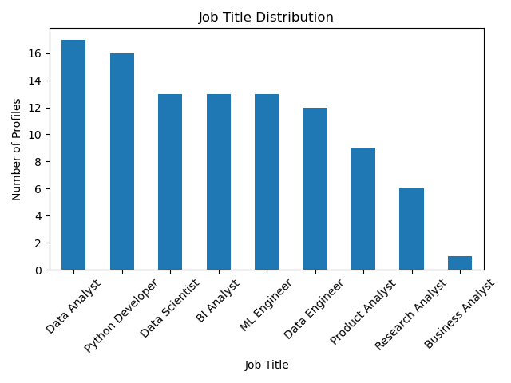

👨‍💻 Author
<Br>
Ishwor Chandra Paudyal (ICP)
<Br>
Data Analyst | Python Developer

# LinkedIn Profile Data Analysis (Simulated Dataset)

## 📌 Project Overview
This project analyzes a simulated dataset of 100 LinkedIn-style professional profiles.
The goal is to demonstrate data analysis skills using Python, Pandas, and Matplotlib.

⚠️ Note: This dataset is completely fake and created only for learning and portfolio purposes.

---

## 📂 Dataset
- 100 professional profiles
- Fields include:
  - Name
  - Job Title
  - Industry
  - Location
  - Experience (Years)
  - Connections

---

## 🛠 Tools Used
- Python
- Pandas
- Matplotlib
- Jupyter Notebook

---

## 📊 Analysis Performed
- Job title distribution
- Average experience by role
- Visualization of professional roles

---

## 📈 Sample Visualization

## 📊 Advanced Visualizations
- Average Experience by Role
- Experience vs Connections Scatter Plot
- Industry-wise Profile Distribution
- Top 10 Most Connected Profiles


---

## 🚀 How to Run
```bash
pip install -r requirements.txt
cd analysis
python linkedin_analysis.py


---

## 🔥 HOW TO PUSH TO GITHUB (FINAL STEP)

```bash
git init
git add .
git commit -m "LinkedIn profile analysis project"
git branch -M main
git remote add origin https://github.com/YOUR_USERNAME/linkedin-profile-analysis.git
git push -u origin main
